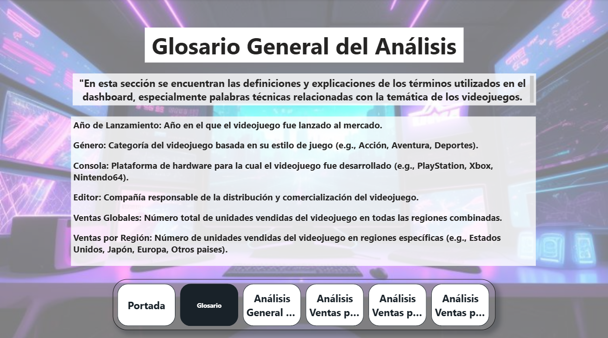
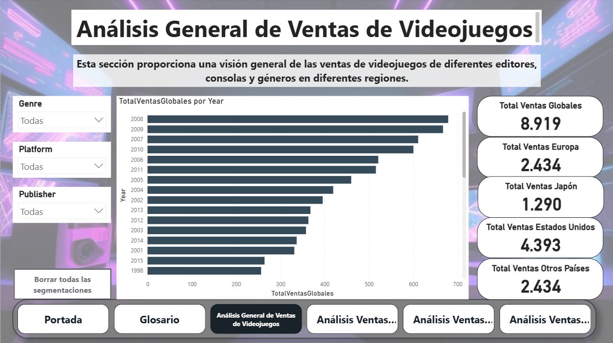
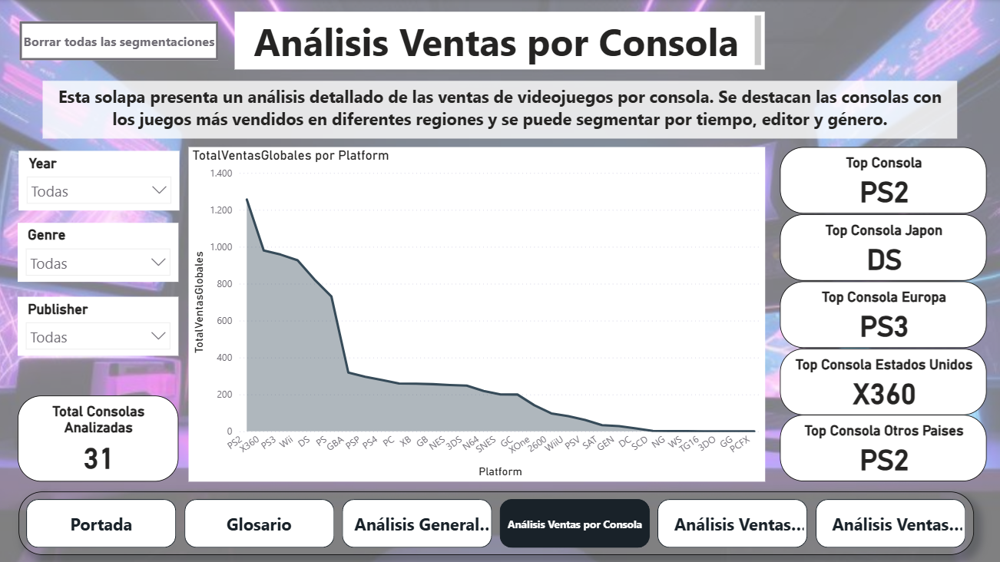
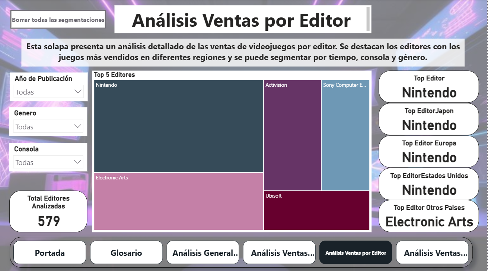
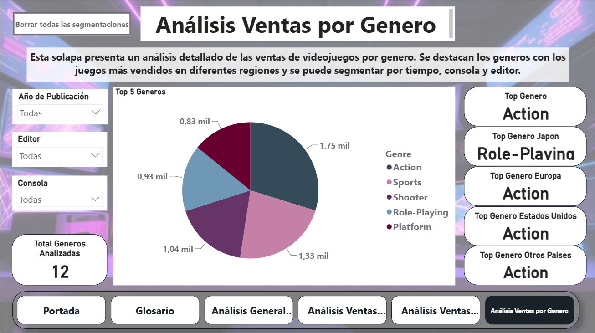

# 📊 Análisis de Ventas Globales de Videojuegos

Proyecto final del curso de Analista de Datos en **Coderhouse (2024)**. Consiste en un modelo de datos dimensional y un dashboard interactivo en Power BI para analizar las tendencias de ventas de videojuegos a nivel global, segmentadas por regiones geográficas[cite: 1].

## 🛠️ Tecnologías y Herramientas
- **Power BI & DAX:** Modelado dimensional (esquema estrella), creación de más de 15 medidas calculadas (`TOPN`, `SUM`, `DISTINCTCOUNT`) y tabla calendario personalizada[cite: 1].
- **Excel:** Limpieza y estructuración inicial de los datos[cite: 1].
- **Documentación:** Especificación de objetivos, alcance y análisis de hipótesis de negocio[cite: 1].

---

## 🚀 Vistas del Dashboard

### 1. Portada

### 2. Glosario

### 3. Análisis General

### 4. Análisis por Consola

### 5. Análisis por Editor

### 6. Análisis por Género

---

## 📁 Estructura del Repositorio
- `/assets`: Capturas de pantalla del reporte de Power BI.
- `/data`: Archivo Excel utilizado como fuente de datos.
- `/docs`: Documentación técnica y PDF con el desglose de la hipótesis y el análisis operativo, táctico y estratégico[cite: 1].
